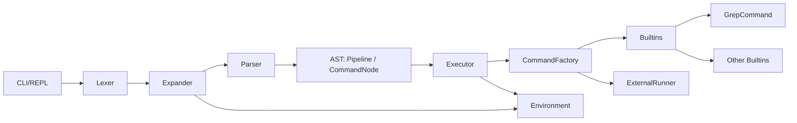

# Архитектура

## Введение
Документ описывает архитектуру CppShell: ключевые компоненты и их диаграмму, поток обработки команд, модель данных (AST) и правила передачи потоков в pipeline. Ответы на вопросы про нюансы разработки. Цель — дать единое представление о том, как строка ввода превращается в набор запускаемых команд и как между ними передаются данные.

## Компоненты и ответственность
- **CLI/REPL**: читает строку, управляет циклом, вызывает конвейер обработки.
- **Lexer**: разбивает вход на токены с учётом кавычек и экранирования.
- **Expander**: выполняет подстановки переменных (`$NAME`) и разворачивает присваивания окружения.
- **Parser**: строит объектное представление (AST) из токенов.
- **Environment**: хранит переменные, поддерживает присваивания `NAME=value`.
- **CommandFactory**: создаёт исполняемые команды (builtin или внешняя прогрмамма).
- **Executor**: запускает команды, управляет pipeline и потоками.
- **Builtins**: реализация `cat`, `echo`, `wc`, `pwd`, `exit`, `grep`.
- **ExternalRunner**: запуск внешних программ, передача аргументов и потоков.

## Объектная модель (AST)
- **Pipeline**: список `CommandNode`, соединённых оператором `|`.
- **CommandNode**: имя команды, список аргументов, набор локальных присваиваний окружения.
- **Redirections**: описание перенаправлений потоков.

## Поток исполнения
1. CLI получает строку ввода.
2. Lexer токенизирует строку с учётом кавычек.
3. Expander выполняет подстановки `$` до токенизации.
4. Parser строит AST (`Pipeline` -> `CommandNode`).
5. Executor обходит AST и запускает pipeline:
   - для каждой команды создаётся экземпляр через `CommandFactory`;
   - `Builtins` исполняются в процессе интерпретатора;
   - внешние команды запускаются через `ExternalRunner`.
6. Executor соединяет stdout предыдущей команды со stdin следующей.
7. Коды возврата сохраняются; итоговый код pipeline определяется кодом возврата последней команды в pipeline.

## Обработка ввода: парсинг, подстановки, окружение

### Парсинг и токенизация
- Разделители: пробелы и `|`, если они не находятся внутри кавычек.
- Одинарные кавычки: содержимое берётся буквально; `$` не разворачивается.
- Двойные кавычки: пробелы сохраняются как часть аргумента; `$` допускается для подстановок.
- Экранирование: обратный слэш внутри двойных кавычек экранирует `"` и `$`; вне кавычек экранирует следующий символ.
- Пайп `|` формирует границы между командами в `pipeline`.

### Подстановки `$`
- Подстановки выполняются до финальной токенизации: сначала строятся временные токены с учётом кавычек, затем разворачиваются переменные.
- Поддерживаются последовательные подстановки в одном токене (пример: `$x$y`).
- Если переменная не найдена, подстановка даёт пустую строку.

### Окружение
- Присваивания `NAME=value` допускаются перед командой и применяются как локальные для её выполнения.
- Цепочка присваиваний влияет на последующую подстановку внутри той же команды.
- Команда `exit` завершает интерпретатор без изменения окружения.

### Конфигурационный файл
- `config.yml`
- Считывается один раз при старте интерпретатора и сохраняется в модуле `environment/runtime`.
- Примеры параметров для расширяемости:
  - `output_dir`: базовая директория для относительных путей перенаправлений.
  - `allow_external`: разрешить/запретить запуск внешних программ.
  - `prompt`: формат приглашения CLI.
  - `max_pipeline_length`: ограничение длины pipeline.
  - `history_file`: путь к истории команд (опционально на будущее).

## Исполнение команд и pipeline

### Создание команд
- `CommandFactory` определяет тип команды: builtin или внешняя.
- Builtin-команды исполняются в процессе интерпретатора (без форка).
- Внешние команды запускаются через `ExternalRunner` с передачей argv и окружения.

### Pipeline и потоки
- Для каждой команды, кроме последней, создаётся pipe для перенаправления stdout.
- stdin первой команды — текущий stdin интерпретатора, stdout последней — текущий stdout.
- Закрытие неиспользуемых концов pipe обязательно, чтобы избежать дедлоков.
- Команды в pipeline запускаются последовательно с подготовкой потоков, ожидание завершения — после запуска всех.

### Передача потока данных в команду
- `Executor` формирует цепочку потоков: входом команды считается либо stdin интерпретатора, либо read-end предыдущего pipe.
- Выход команды направляется либо в stdout интерпретатора, либо в write-end следующего pipe.
- Встроенные команды получают вход/выход как абстрактные потоки (например, `istream/ostream`) и читают/пишут напрямую.
- Внешние команды запускаются с переназначением стандартных дескрипторов: stdin/stdout процесса указывают на нужные концы pipe.
- Таким образом, данные движутся только по связке stdin → stdout, а `Executor` отвечает за их "склейку" между командами.
- Аргументы команды (`argv`) и входной поток (stdin) — разные сущности: аргументы задаются при парсинге, а stdin — это источник байтов во время выполнения (например, `wc file.txt` использует аргумент, `cat file.txt | wc` читает stdin).
- Обработка потока происходит в рантайме выполнения: команда читает stdin (встроенная — через переданный `istream`, внешняя — через дескриптор 0) и пишет в stdout; `Executor` лишь настраивает источники/приёмники и связывает их pipes.

### Поведение `exit`
- `exit` в одиночной команде завершает основной цикл интерпретатора.
- `exit` в составе pipeline рассматривается как обычная команда текущего процесса и не завершает интерпретатор.

## Диаграмма компонентов (Mermaid)

## Модульная структура
- **cli**: REPL-цикл (чтение строки, обработка `exit`) и запуск конвейера обработки.
- **input-processing**: токенизация с учётом кавычек/экранирования и подстановки `$`.
- **parser**: построение AST (Pipeline/CommandNode).
- **environment**: хранение переменных окружения и присваиваний.
- **executor**: запуск команд и управление pipeline.
- **commands**: встроенные команды и запуск внешних программ.

### Границы и зависимости
- `cli` вызывает `input-processing`, `parser` и `executor`.
- `parser` получает готовые токены и возвращает AST, не знает о запуске процессов.
- `input-processing` использует `environment` только для подстановок.
- `executor` использует `commands` и `environment`, но не зависит от `input-processing`.

## Ответы на контрольные вопросы
- **Команды и pipeline**: команды представлены как `CommandNode`, pipeline — как список команд в `Pipeline` (AST).
- **Создание команд**: `CommandFactory` создаёт builtin или внешнюю команду.
- **Исполнение команд**: `Executor` запускает команды, builtins выполняются в процессе интерпретатора, внешние — через `ExternalRunner`.
- **Взаимодействие потоков в pipeline**: `Executor` соединяет stdout предыдущей команды со stdin следующей через pipe.
- **Разбор входной строки**: выполняется в `Lexer` и `Parser`, с учётом кавычек и экранирования.
- **Подстановки**: выполняются в `Expander` до финальной токенизации, с использованием `Environment`.
- **Переменные окружения**: хранятся в `Environment` как `name -> value`, поддерживаются локальные присваивания `NAME=value`.
- **Многопоточность**: не используется; параллелизм достигается через процессы и pipes.

## Текущая версия

В этом документе выше описана целевая архитектура. Ниже - краткая сводка того,
что именно реализовано в текущей версии и какие ограничения стоит учитывать.

- Реализовано:
  - Токенизация с поддержкой одинарных и двойных кавычек и экранирования.
  - Локальные присваивания `NAME=value` перед командой и их применение.
  - Подстановки переменных (`$NAME`, `${NAME}`) и арифметических выражений.
  - Полноценная поддержка pipeline (`|`) с передачей потоков данных (stdout -> stdin).
  - Builtin-команды: `cat`, `echo`, `wc`, `pwd`, `exit`, `grep`.
  - Запуск внешних программ с передачей `argv` и окружения.
  - Тесты (doctest) и рабочий CI для сборки и базового статического анализа.
  - Интеграционные тесты для проверки конвейеров и подстановок.

- Известные ограничения:
  - Ограниченная поддержка арифметики (базовый парсинг).